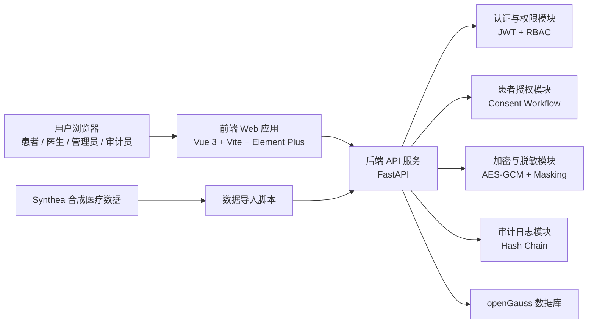

# 智慧医疗病历安全系统：组内简明计划书

## 1. 项目定位

本项目面向《Computer and Data Security》group project，计划实现一个安全导向的智慧医疗病历系统。项目重点是通过一个可运行 Demo 展示医疗数据安全机制：医患关系默认授权、患者可撤回授权、医生按权限访问、病历加密存储、敏感字段脱敏、访问行为审计，以及审计日志防篡改验证。

课程作业要求包括文献调研、项目描述、系统开发与演示、书面报告和课堂展示。本项目可以对应到机密性、完整性、身份认证、访问控制、密码学和问责审计等课程核心内容。

## 2. 总体设计架构

系统采用前后端分离架构：

核心访问流程：

1. 用户登录后，后端根据 JWT 识别身份与角色。
2. 医生进入首页后先看到“我的病人列表”，列表按默认授权、额外授权待审批、已过期、已撤销等状态分组。
3. 对处于默认授权状态的病人，医生可以直接点开并查看默认范围内的必要病历信息。
4. 医生访问病历详情时，后端仍检查角色、授权状态、授权范围和时间。
5. 如果医生需要查看默认范围之外的内容，可以提交额外授权申请。
6. 患者可以查看当前医生访问权限，并随时撤回授权。
7. 校验通过后，后端解密病历，按授权范围脱敏，再返回给前端。
8. 每一次允许、拒绝、默认授权创建或撤回授权都会写入审计日志。
9. 审计员可以验证日志哈希链，发现日志是否被篡改。

## 3. 最终技术栈

为便于快速完成 Demo，并减少前后端联调和方案摇摆成本，本项目统一采用以下技术组合：

| 层次 | 推荐技术 |
|---|---|
| 前端 | Vue 3 + Vite + Element Plus |
| 后端 | FastAPI |
| 数据库 | openGauss |
| ORM | SQLAlchemy 2.x 或 SQLModel，使用 `psycopg2` / `psycopg` 等 PostgreSQL 兼容驱动 |
| 登录认证 | JWT |
| 密码存储 | bcrypt |
| 病历加密 | Python `cryptography` 库的 AES-256-GCM |
| 审计完整性 | SHA-256 哈希链 |
| 数据来源 | Synthea 生成合成患者数据 |
| 接口文档 | FastAPI 自动生成 Swagger / OpenAPI |
| 开发协作 | Git + GitHub / Gitee，补充 Markdown 说明文档 |

选择这套方案的原因是：本项目评分重点在安全机制和可运行演示，而不是企业级后端复杂度。FastAPI 适合快速实现认证、权限、加密、审计日志和 Synthea 数据导入；Vue 3 + Element Plus 适合快速搭建患者端、医生端、管理员端和审计员端这些表格与表单较多的页面；openGauss 可以作为更有特色的数据库选型，同时后端仍可沿用 PostgreSQL 风格的连接方式。

## 4. 系统角色与权限

| 角色 | 主要功能 | 安全边界 |
|---|---|---|
| 患者 Patient | 查看自己的病历、查看医生访问权限、撤销医生访问、审批额外授权、查看访问记录 | 患者拥有撤回授权和查看访问透明度的权利 |
| 医生 Doctor | 查看我的病人列表、访问默认授权范围内的病历、申请额外访问、查看已授权范围内的病历 | 默认授权只覆盖必要病历范围，患者撤回后立即失效 |
| 管理员 Admin | 管理账号、审核医生身份、维护系统基础数据 | 默认不能查看解密病历 |
| 审计员 Auditor | 查看访问日志、验证日志完整性、发现异常访问 | 只能看日志，不能看病历内容 |

## 5. 需要实现的核心功能

### 5.1 登录与角色管理

- 用户名密码登录。
- 密码只保存哈希值，不能保存明文。
- 登录后签发 JWT。
- 根据角色限制接口访问。
- 准备四类演示账号：患者、医生、管理员、审计员。

### 5.2 患者病历管理

- 导入 Synthea 生成的合成患者数据。
- 保存患者基本信息和病历记录。
- 病历正文以结构化 JSON 表示，再加密存入 openGauss。
- 前端提供患者病历列表和详情页面。

### 5.3 医生默认访问与额外申请

- 医生首页展示“我的病人列表”，包含与该医生有关的患者。
- 病人列表按授权状态区分：默认授权、额外授权待审批、已过期、已撤销。
- 对默认授权且未过期的病人，医生可以直接查看默认范围内的必要病历信息。
- 病历详情接口仍必须做后端授权校验，确认授权未被撤销、未过期，且访问范围没有超出默认授权。
- 对已撤销或已过期的病人，医生只能查看状态并发起重新授权或额外授权申请。
- 医生可以搜索不在当前列表中的新患者。
- 如果医生需要查看默认范围之外的内容，例如完整病历、全部化验或敏感诊断，需要提交额外访问申请并填写原因。
- 额外申请状态包括：待审批、已通过、已拒绝、已撤销、已过期。

### 5.4 患者授权查看与撤销

- 患者可以查看当前哪些医生拥有默认访问权限。
- 患者可以查看医生的额外访问申请。
- 患者可以审批额外授权范围，例如基本信息、诊断、化验、用药、完整病历。
- 患者可以随时撤销医生的默认授权或额外授权。
- 撤销后医生再次访问对应病历范围应立即失败。

### 5.5 加密存储与脱敏展示

- 病历写入数据库前使用 AES-GCM 加密。
- openGauss 中不能直接看到明文诊断、化验、用药、病程记录等敏感信息。
- 后端只在权限校验通过后解密。
- 按授权范围对返回数据做脱敏，例如手机号隐藏中间位、地址只显示城市、未授权病历字段隐藏。

### 5.6 审计日志与防篡改

- 记录登录成功、登录失败、默认授权创建、申请额外访问、批准授权、拒绝授权、撤销授权、查看病历、访问被拒绝等行为。
- 日志记录操作者、角色、患者、病历、动作、结果、时间、IP 等信息。
- 每条日志保存上一条日志哈希和当前日志哈希，形成哈希链。
- 审计员页面提供完整性验证按钮。
- 演示时可以手动修改数据库中的旧日志，再验证系统能发现篡改。

## 6. openGauss 主要数据表

建议先实现以下核心表，避免数据库设计过度复杂：

| 表名 | 用途 |
|---|---|
| users | 登录账号、密码哈希、角色、状态 |
| patients | 患者基本信息，与用户账号关联 |
| doctors | 医生信息、科室、执照号、审核状态 |
| medical_records | 加密后的病历数据、IV、认证标签、加密数据密钥 |
| consents | 默认临床授权、额外访问申请与患者撤销记录 |
| audit_logs | 安全审计日志和哈希链字段 |

后续如时间充足，可以增加 departments、record_attachments、security_events 等扩展表。

## 7. 最小可演示版本目标

最终 Demo 至少要能完整展示以下场景：

1. 数据库中病历是密文，不能直接看到明文医疗内容。
2. 医生首页展示“我的病人列表”，能看到默认授权、额外授权待审批、已过期、已撤销等状态。
3. 医生点击默认授权患者时，可以直接看到默认范围内的必要病历信息。
4. 医生申请查看默认范围之外的内容时，需要患者额外审批。
5. 患者撤销授权后，医生再次访问对应病历范围被拒绝并记录日志。
6. 审计员查看访问日志，并验证日志哈希链完整性。
7. 手动篡改一条旧日志后，系统能检测出日志链异常。

## 8. 项目搭建阶段四人初步分工

按“业务模块 + 对应页面 + 测试材料”的方式分工。每个人负责一条相对完整的功能线，同时共享数据库设计和最终演示任务。

| 成员 | 初步负责方向 | 搭建阶段任务 |
|---|---|---|
| 成员 A：基础框架与账号模块 | 项目骨架、登录认证、用户角色 | 初始化 FastAPI 后端和 Vue 前端项目；配置 openGauss、SQLAlchemy/SQLModel 和 `.env`；实现用户表、登录接口、JWT、bcrypt 密码哈希、基础 RBAC；完成登录页和角色跳转 |
| 成员 B：病历数据与加密模块 | Synthea 数据、病历入库、加密存储 | 运行 Synthea 生成合成数据；编写患者和病历导入脚本；设计 patients、doctors、medical_records 表；实现 AES-GCM 加密入库和解密服务；准备数据库密文展示材料 |
| 成员 C：患者授权与医生访问模块 | 默认授权、我的病人列表、访问控制、脱敏展示 | 实现医生“我的病人列表”、默认授权状态分组、搜索新患者、额外授权申请、患者审批/拒绝/撤销授权；设计 consents 表；实现病历详情接口的授权校验和按范围脱敏；完成患者端和医生端主要页面 |
| 成员 D：审计日志与展示材料模块 | 审计、防篡改、测试与报告 | 设计 audit_logs 表；实现访问日志记录、拒绝访问记录和 SHA-256 哈希链验证；完成审计员页面；整理测试用例、演示脚本、报告结构和 PPT 素材 |

公共协作任务：四个人共同确认接口命名、数据库字段和演示账号；每个成员负责自己模块的接口说明、测试截图和报告小节，避免最后文档与系统实现脱节。

## 9. 各阶段任务

| 阶段 | 目标 |
|---|---|
| 第 1 阶段：项目初始化 | 建好前后端项目、openGauss 数据库、基础表结构和 Git 仓库 |
| 第 2 阶段：登录与角色 | 完成登录、JWT、角色权限和四类演示账号 |
| 第 3 阶段：数据导入与加密 | 导入 Synthea 数据，病历加密入库，数据库可展示密文 |
| 第 4 阶段：授权流程 | 完成默认临床授权、额外授权申请、患者审批、授权访问、撤销授权 |
| 第 5 阶段：审计与防篡改 | 完成审计日志、哈希链、完整性验证页面 |
| 第 6 阶段：测试与展示 | 固定演示脚本，补充测试截图，整理报告和 PPT |
